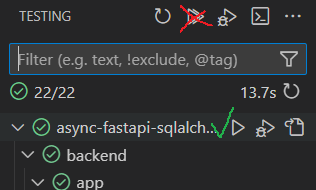

[](https://github.com/psf/black)

# Async FastAPI SQLAlchemy Template

This is a ready-to-run [FastAPI](https://fastapi.tiangolo.com/) backend with async
[SQLAlchemy](https://www.sqlalchemy.org/), which can be used as a template. It also uses
[alembic](https://alembic.sqlalchemy.org/en/latest/) for database migrations and
[pytest](https://docs.pytest.org/en/8.2.x/) for testing.

This project is heavily inspired by
[Full Stack FastAPI Template](https://github.com/tiangolo/full-stack-fastapi-template)
and
[demo-fastapi-async-sqlalchemy](https://github.com/ThomasAitken/demo-fastapi-async-sqlalchemy),
but has the following features:

- The API implements basic CRUD functionality for the users as well as auth logic.
- No need in docker usage, the code can be run locally. Some instructions for
  setup, debugging, etc. can be found below.
- Tests basic implementation with pytest, suitable for async SQLAlchemy, with SQLite or
  Postgres powered by
  [testing.postgresql](https://github.com/tk0miya/testing.postgresql) as a database.

## Setup

The project is structured so that all backend-related files are kept inside `./backend`
folder and not the project's root folder (besides the `.env` file which can be used for
both parts - frontend and backend). This also means that all commands should be run from
the `backend` folder and in further docs this is assumed unless the project's root
folder is explicitly mentioned.

The code was written with Python 3.12, but 3.11 should also work, so ensure you have the
supported version and install dependencies with `pip install -r requirements-dev.txt`.

The settings are configured via environment variables. The common way to set them up is
via the `.env` file in the project's root folder. Check the
[config](./backend/app/config.py) file to see which environment variables can or must be
set up. The dialect and driver for `DATABASE_URL` should be `postgresql+asyncpg`.

Also, specify the `PYTHONPATH` environment variable as `./backend`.

### Database initialization

The database schema must be initialized via
[alembic](https://alembic.sqlalchemy.org/en/latest/). Ensure the `DATABASE_URL`
environment variable is specified and run `alembic upgrade head`.

After the schema is initialized, the initial superuser must be created. This can be done
with the `python -m app.initial_data` command.

### Running the API

When dependency packages are installed, environ variables are set up, the database is
initialized and accessible, the API can be run with `fastapi dev app/main.py`.

### Running tests

Tests can be run with SQLite or Postgres as a database (see
[conftest](./backend/app/tests/conftest.py)) with `python -m pytest ./app/tests`.

To use Postgres, the PostgreSQL server must be installed and accessible via the PATH
variable (see testing.postgresql
[README](https://github.com/tk0miya/testing.postgresql)).
It should not be difficult to implement Postgres support in a different way though.

## VS Code settings

### General settings

Set `python.testing.pytestPath` as `python -m pytest`. If you want to use
[flake8](https://flake8.pycqa.org/en/latest/) as a linting tool, set `flake8.cwd` as
`${workspaceFolder}/backend`.

### Debugging

For debug mode, you can use the following configuration:

```json
{
    "name": "Python Debugger: FastAPI",
    "type": "debugpy",
    "request": "launch",
    "cwd": "${workspaceFolder}/backend",
    "module": "uvicorn",
    "args": [
        "app.main:app",
        "--reload"
 ],
    "jinja": true
}
```

### Testing

With configured `python.testing.pytestPath` VS Code testing should be able to work.
However, the global `Run Tests` option does not work properly because `asyncio` mode is
not fetched from [`pytest.ini`](./backend/app/pytest.ini) file. Solutions are welcome,
but currently only `Run Test` can be used:


